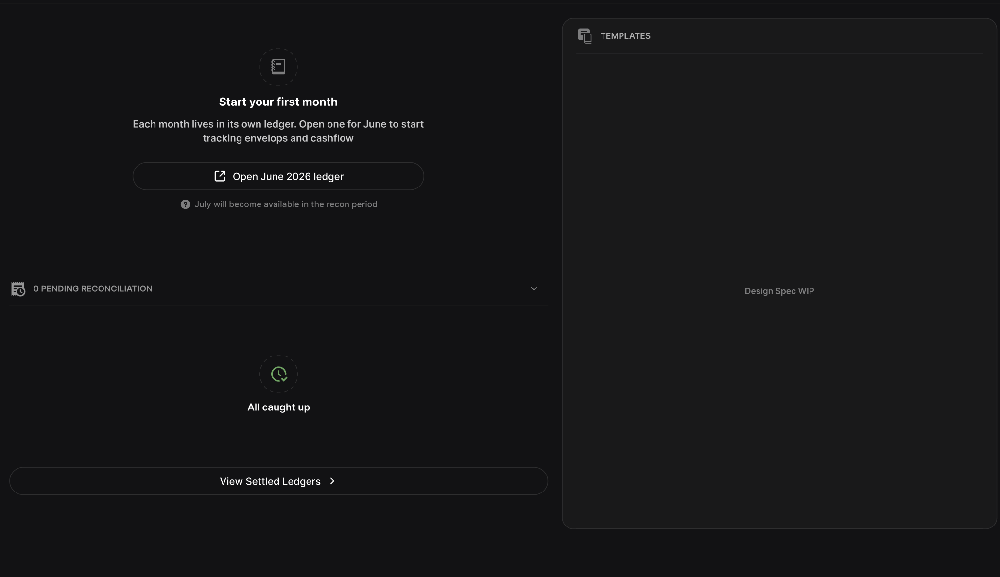
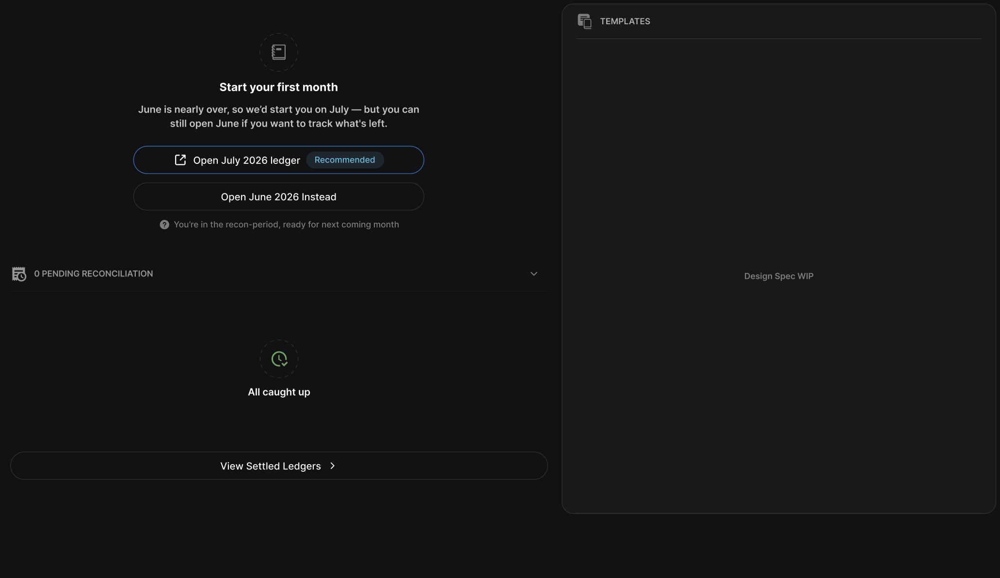

# [FE] Fresh dashboard state on finance app, to apply entry points on creating or setup monthly ledger

**Type** Feature
**Epic:** _<parent epic — the journey this step belongs to>_

### Summary

To deliver the Home page of finance app, with fresh states and placement for CTA - entrypoint that facilitate the flow of creating a new monthly ledger

### User Story

> **As a** user,
> **I want** to see a home dashboards upon entry to finance app, seeing the state of my financial status and ledgers
> **so that** I can start setting up my first monthly ledger to get started based on the data state.

### Description / Context

User is on a fresh onboarded status with nothing being setup, no financial data to be shown, and depends on the date when user enters the finance home dashboard, based on the 7 days threshold period, dashboard will display a different CTA and UI flow to get started on ledger setup.

### DESIGN

> SCENARIO: User on first time usage where, no active ledgers, 0 pending and `Today` does not fall within LeadDay
> 

> SCENARIO: User on first time usage where, no active ledgers, 0 pending and `Today` fall within Recon-period
> 

### Acceptance Criteria

```gherkin
SCENARIO 1:
    Given User on fresh, no active legders, 0 pendings and `today` does not fall within Lead-Day (default 7 days)
    When User navigate into the finance dashboard route
    Then User should see 1 single CTA to create ledger (see screen)

SCENARIO 2:
    Given user on fresh, no active ledgers, 0 pendings and `today` fall within lead-day
    When. user navigate into finance dashboard route
    Then user will have 2 option, (2 CTA), which is they can open the almost dued ledgers or simply open the incoming months (see screen)

SCENARIO 3: (OUT OF SCOPE RELATED UI)
    Given any user onboarded, or financial data status
    When user navigate into finance dashboard route
    Then `TEMPLATE` panel should have placeholder, `pending reconciliation section` should be as per design and `View settled ledgers` CTA wont be placeholder too
```

## Technical Notes

- Always use our UI kits collections as much as possible or, add a new component into kitd if needed, than export for usage to apply in this story.

### Out of scope

- Template Section -> Build a placeholder as per screen, with no functionality
- Pending Reconciliation Section Accordiance -> Build a placeholder as per screen without any data integration
- CTA `View Settled Ledgers` -> just add the button there, without any event handling.
- Actualt flow for creation of monthlty ledgers -> the 2 main CTA for creation ledgers should be eventless, but button mustv be displayed according to scenarios. (SEE ###Acceptance Criteria)

### Dependencies

- Blocked by: \_\_\_
- Blocks: \_\_\_

### Definition of Done

> **Scope note:** FE-only story. No data integration and no BFF call — the two ledger-creation CTAs and `View Settled Ledgers` are rendered per scenario but carry **no click handlers** (see Out of Scope). "BFF endpoint documented" is therefore **N/A** for this story.

_Functional_

- [ ] Finance Home route renders the fresh/empty dashboard on entry (no active ledger, 0 pending).
- [ ] **Scenario 1** (`today` _outside_ the Lead-Day window, default 7 days): a single primary CTA `Open <currentMonth> <year> ledger` is shown with the caption `<nextMonth> will become available in the recon period` — matches `EF3.10-image2.png`.
- [ ] **Scenario 2** (`today` _inside_ the Lead-Day / recon window): two CTAs — `Open <nextMonth> <year> ledger` flagged **Recommended** (primary) and `Open <currentMonth> <year> Instead` (secondary) — with the caption `You're in the recon-period, ready for next coming month` — matches `EF3.10-image1.png`.
- [ ] Which scenario renders is derived purely from the current date vs the Lead-Day threshold; month/year labels are computed, not hard-coded.

_Placeholders (out of scope — presentational only, no data/handlers)_

- [ ] `TEMPLATES` panel renders as a placeholder ("Design Spec WIP").
- [ ] Pending Reconciliation section renders per design: `0 PENDING RECONCILIATION` collapsible header + `All caught up` empty state.
- [ ] `View Settled Ledgers` CTA is present per design with no click handler.
- [ ] Both ledger-creation CTAs are eventless (no handler / no navigation), display-only per scenario.

_Quality_

- [ ] UI is built from the shared UI kit; any new component is added to the kit and exported before use (per Technical Notes).
- [ ] Unit/component tests cover scenario selection at the Lead-Day boundary (inside vs outside the window) and both CTA layouts.
- [ ] Acceptance criteria (Scenarios 1–3) verified against Figma at the referenced version.
- [ ] `bun run check` is green across the workspace (typecheck, lint, tests) — the merge gate.
- [ ] Code merged; reviewed and approved by reporter.
