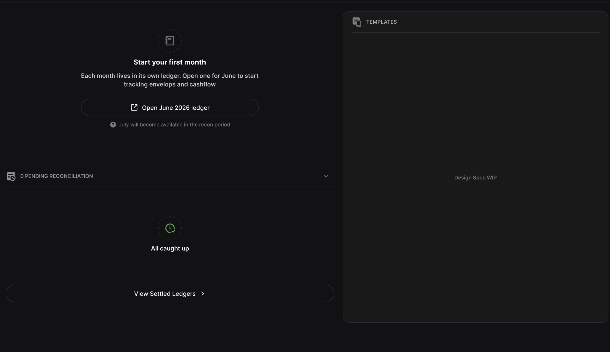
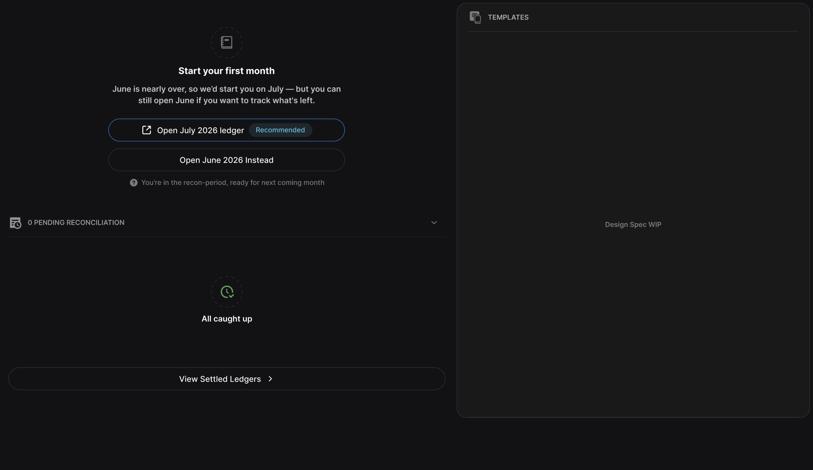

# [FE] Fresh dashboard state on finance app, to apply entry points on creating or setup monthly ledger

**Type** Feature
**Epic:** _<parent epic — the journey this step belongs to>_

### Summary

To deliver the Home page of finance app, with fresh states and placement for CTA - entrypoint that facilitate the flow of creating a new monthly ledger.

The Home also owns the **display decision** on its primary (left) column: from the user's ledger state it renders **either** the **empty/fresh state** (with its two Lead-Day variants) **or** a placeholder **Ledger Detail Card**. This story is **UI-only** — the decision is driven by an **injected/mocked ledger-state seam** (`hasActiveLedger` + `isWithinLeadDay`); the real read that backs the seam is split out to **EF3.13**.

### User Story

> **As a** user,
> **I want** to see a home dashboards upon entry to finance app, seeing the state of my financial status and ledgers
> **so that** I can start setting up my first monthly ledger to get started based on the data state.

### Description / Context

User is on a fresh onboarded status with nothing being setup, no financial data to be shown, and depends on the date when user enters the finance home dashboard, based on the 7 days threshold period, dashboard will display a different CTA and UI flow to get started on ledger setup.

On entry, the Home derives what to render on the **left column** from a **ledger-state seam** with two inputs:

- **`hasActiveLedger`** — whether the user has an **active (`ongoing`) ledger** (the single active working surface per `monthly-ledger.md` §3; `reconciling` / `settled` do **not** count). `0` active → render the empty/fresh state; `≥1` active → render the placeholder **Ledger Detail Card**.
- **`isWithinLeadDay`** — whether `today` falls within the Lead-Day window (default 7 days). This only selects **which empty-state variant** shows (see DESIGN / Acceptance Criteria) and is **irrelevant** once an active ledger exists.

In this story the seam is **injected/mocked** — the branching, both empty-state variants, and the placeholder card are all driven by props/fixture state, with **no real fetch**. Wiring the seam to the real finance read surface is **EF3.13**.

### DESIGN

> SCENARIO: User on first time usage where, no active ledgers, 0 pending and `Today` does not fall within LeadDay
> 

> SCENARIO: User on first time usage where, no active ledgers, 0 pending and `Today` fall within Recon-period
> 

> SCENARIO: User has an active (`ongoing`) ledger — the left column renders the placeholder `Ledger Detail Card` instead of the empty state. Presentational placeholder only; no dedicated design image yet.

**Display decision (left column):**

```
resolve ledger-state (injected seam)
  → hasActiveLedger?
      yes → render <LedgerDetailCard/>          (placeholder — no data, no handlers)
      no  → render <FreshLedgerEmptyState/>
              → isWithinLeadDay?
                  no  → Scenario 1 (single CTA)
                  yes → Scenario 2 (two CTAs)
```

`active` means a `status === 'ongoing'` ledger — the one active working surface (`monthly-ledger.md` §3). The **roll-forward-gap** case (the user had ledgers but the current month has none) is **out of scope** here — it belongs to the persistent hub warning (separate ticket), not this branch.

### Acceptance Criteria

```gherkin
SCENARIO 1: (no active ledger — outside Lead-Day)
    Given User on fresh, no active legders, 0 pendings and `today` does not fall within Lead-Day (default 7 days)
    When User navigate into the finance dashboard route
    Then User should see 1 single CTA to create ledger (see screen)

SCENARIO 2: (no active ledger — inside Lead-Day)
    Given user on fresh, no active ledgers, 0 pendings and `today` fall within lead-day
    When. user navigate into finance dashboard route
    Then user will have 2 option, (2 CTA), which is they can open the almost dued ledgers or simply open the incoming months (see screen)

SCENARIO 3: (has an active ledger — renders the detail-card placeholder)
    Given the user has >= 1 active (`ongoing`) ledger
    When user navigate into the finance dashboard route
    Then the left column renders the placeholder `Ledger Detail Card` (NOT the empty state, NOT the creation CTAs)
    And the Lead-Day check does not affect what the left column renders

SCENARIO 4: (OUT OF SCOPE RELATED UI)
    Given any user onboarded, or financial data status
    When user navigate into finance dashboard route
    Then `TEMPLATE` panel should have placeholder, `pending reconciliation section` should be as per design and `View settled ledgers` CTA wont be placeholder too
```

## Technical Notes

- Always use our UI kits collections as much as possible or, add a new component into kitd if needed, than export for usage to apply in this story.
- The left-column branch is a **pure presentational function of the injected seam** (`hasActiveLedger`, `isWithinLeadDay`) — no data-fetching, no clock read baked into the branch. Tests drive it by feeding the seam directly (see Quality).
- `isWithinLeadDay` mirrors the domain's Lead-Day rule (`@nafios/finance` `isWithinCreationWindow(today, leadDays)` / `resolveCreationState`, `leadDays` fixed at 7). EF3.10 does **not** call these — it accepts the resolved boolean via the seam so the same rule is honoured once EF3.13 wires the real read.
- The `Ledger Detail Card` is a **named placeholder component** for this story (empty shell, no props wired) so EF3.13 / the ongoing-ledger view can later fill it without moving the branch.

### Out of scope

- Template Section -> Build a placeholder as per screen, with no functionality
- Pending Reconciliation Section Accordiance -> Build a placeholder as per screen without any data integration
- CTA `View Settled Ledgers` -> just add the button there, without any event handling.
- Actualt flow for creation of monthlty ledgers -> the 2 main CTA for creation ledgers should be eventless, but button mustv be displayed according to scenarios. (SEE ###Acceptance Criteria)
- **Real ledger-state read / finance read surface** -> the seam is injected/mocked in this story. Fetching the user's ledgers to resolve `hasActiveLedger` + Lead-Day is owned by **EF3.13**.
- **`Ledger Detail Card` content** -> render the placeholder shell only (no data, no metrics, no handlers). The populated card is a later ticket.
- **Roll-forward-gap state** (had ledgers, current month empty) -> the persistent hub warning is a separate ticket, not this branch.

### Dependencies

- Blocked by: \_\_\_
- Blocks: \_\_\_
- Relates to: **EF3.13** — [BE] Finance Home ledger-state read surface. EF3.13 provides the real read that **replaces the injected seam** in this story (the seam's shape — `hasActiveLedger` + `isWithinLeadDay` — is the contract between the two).

### Definition of Done

> **Scope note:** FE-only story. The left-column display decision is driven by an **injected/mocked ledger-state seam** — there is still **no data integration and no BFF call in this story** (the real read is EF3.13). The two ledger-creation CTAs and `View Settled Ledgers` are rendered per scenario but carry **no click handlers** (see Out of Scope). "BFF endpoint documented" is therefore **N/A** for this story (it is owned by EF3.13).

_Functional_

- [ ] Finance Home route renders the fresh/empty dashboard on entry (no active ledger, 0 pending).
- [ ] **Left-column display decision**: the primary column branches on the injected seam — `hasActiveLedger === false` → the empty/fresh state; `hasActiveLedger === true` → the placeholder `Ledger Detail Card`. `active` is defined as a `status === 'ongoing'` ledger.
- [ ] **Scenario 1** (`today` _outside_ the Lead-Day window, default 7 days): a single primary CTA `Open <currentMonth> <year> ledger` is shown with the caption `<nextMonth> will become available in the recon period` — matches `EF3.10-image2.png`.
- [ ] **Scenario 2** (`today` _inside_ the Lead-Day / recon window): two CTAs — `Open <nextMonth> <year> ledger` flagged **Recommended** (primary) and `Open <currentMonth> <year> Instead` (secondary) — with the caption `You're in the recon-period, ready for next coming month` — matches `EF3.10-image1.png`.
- [ ] Which empty-state scenario renders is derived purely from the current date vs the Lead-Day threshold (`isWithinLeadDay`); month/year labels are computed, not hard-coded. The Lead-Day check does **not** affect the left column when an active ledger exists.

_Placeholders (out of scope — presentational only, no data/handlers)_

- [ ] `Ledger Detail Card` renders as a placeholder shell (shown only when `hasActiveLedger === true`); no data, no metrics, no handlers.
- [ ] `TEMPLATES` panel renders as a placeholder ("Design Spec WIP").
- [ ] Pending Reconciliation section renders per design: `0 PENDING RECONCILIATION` collapsible header + `All caught up` empty state.
- [ ] `View Settled Ledgers` CTA is present per design with no click handler.
- [ ] Both ledger-creation CTAs are eventless (no handler / no navigation), display-only per scenario.

_Quality_

- [ ] UI is built from the shared UI kit; any new component is added to the kit and exported before use (per Technical Notes).
- [ ] Unit/component tests cover the **display decision** on the injected seam: `hasActiveLedger` true → detail-card placeholder; false → empty state; and, within the empty state, scenario selection at the Lead-Day boundary (inside vs outside the window) and both CTA layouts.
- [ ] Acceptance criteria (Scenarios 1–4) verified against Figma at the referenced version.
- [ ] `bun run check` is green across the workspace (typecheck, lint, tests) — the merge gate.
- [ ] Code merged; reviewed and approved by reporter.
