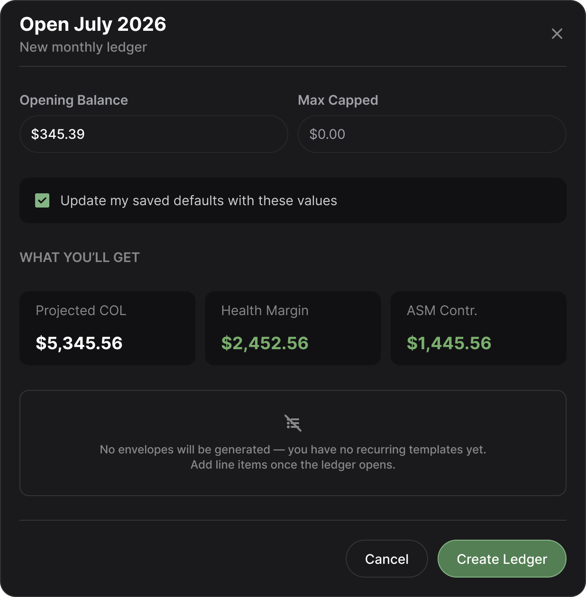

# EF3.11 — [FE] New-ledger creation modal flow (open a monthly ledger)

> - `M1`
> - `type:feature`
> - `module:finance`
> - `area:web`
> - `P0`
> - `size:M`
> - **Epic:** EF3 — Get started: open your first ledger & track it with manual envelopes

> **This ticket is self-contained.** Everything needed to build the "Open ledger" modal flow — the form, the live **WHAT YOU'LL GET** preview, the create-ledger call, the freeze-and-spinner UX, and the hand-off navigation to the ledger sheet — is described here. Stack: **TanStack Start (`apps/web`)**, React, `@nafios/ui` kit, `@nafios/finance` domain + commands. **No new domain formula, no schema change** (EF3 consumes the EF1 schema unchanged).
>
> **Builds directly on EF3.10** (the fresh finance dashboard), which rendered the ledger-creation CTAs **eventless** on purpose. This ticket makes those CTAs live: click → modal → create → land in the new ledger. It **wires the web layer to already-built domain/data pieces** — the derived-metrics engine (EF3.2), the create-ledger command (EF3.7), the openable-month resolver (EF3.4) — it does not re-implement any of them.

---

## Summary

Deliver the end-to-end **"open a new monthly ledger"** flow behind the dashboard CTAs from EF3.10: a modal form where the user manually keys **Opening Balance** and **Max Capped**, sees a live **WHAT YOU'LL GET** preview recomputed on every keystroke, confirms with **Create Ledger**, watches the screen freeze while the ledger is created, and lands on that ledger's sheet page with all its data fetched and ready.

## User Story

> **As a** user starting a new financial month,
> **I want** to open a monthly ledger from a simple form that shows me what I'll get before I commit,
> **so that** I can confirm my opening balance and spending ceiling and start tracking the month in one action.

## Description / Context

Following EF3.10, the finance dashboard shows one or two ledger-creation CTAs depending on the creation window (Scenario 1: `Open <currentMonth> <year> ledger`; Scenario 2: `Open <nextMonth> <year> ledger` **Recommended** + `Open <currentMonth> <year> Instead`). In EF3.10 those buttons are **display-only with no handlers**. This ticket attaches the behaviour.

The target month is **decided by the CTA, not the modal** — the openable-month resolver (EF3.4) already determined which month(s) are offerable, so the modal simply receives the chosen month and renders it in the heading (`Open July 2026`). All CTAs open the **same** modal, parameterized by month.

A brand-new user has **no recurring templates**, so opening a ledger generates **no envelopes** (the "no envelopes" card states this explicitly). The metrics preview therefore starts from an **empty envelope set** — `Projected COL = 0` — and the preview is driven entirely by the two manual inputs (see [WHAT YOU'LL GET](#what-youll-get--live-preview-calculation)).

## DESIGN

> Modal form for opening a new monthly ledger — the basic in-scope fields.
> 

Layout, per the design:

- **Header** — `Open <Month> <Year>` title + `New monthly ledger` subtitle + close (`×`) affordance.
- **Inputs row** — `Opening Balance` (currency) and `Max Capped` (currency), side by side.
- **Checkbox** — `Update my saved defaults with these values` (checked by default in the mock).
- **WHAT YOU'LL GET** — three metric tiles: `Projected COL`, `Health Margin`, `ASM Contr.`
- **No-envelopes card** — always shown: _"No envelopes will be generated — you have no recurring templates yet. Add line items once the ledger opens."_
- **Footer** — `Cancel` (secondary) and `Create Ledger` (primary).

> **Note on the mock's numbers.** The figures in the image (`Projected COL $5,345.56`, `Max Capped $0.00`, etc.) are **illustrative placeholders** and do **not** obey the real formula. The implementation must compute the tiles from the actual inputs per the formulas below — do not hard-code or mirror the mock values.

---

## What you're building — the flow

1. **Trigger.** Clicking any ledger-creation CTA on the dashboard (EF3.10) opens the modal, passing the **target month** the CTA represents. The modal renders that month in its heading.
2. **Render modal.** A centered, focus-trapped dialog (`@nafios/ui` `Dialog`) over a scrim. Dismissible via `Cancel`, `×`, `Esc`, or scrim click — **except while submitting** (see step 7).
3. **Manual inputs.** `Opening Balance` and `Max Capped` are keyed by the user as currency amounts. Both start blank (no config-prefill in EF3 — see epic). Values are held as `Money` (cents) via the EF3.1 codecs, never as floating-point.
4. **Live preview.** On every input change, the three **WHAT YOU'LL GET** tiles recompute (see [below](#what-youll-get--live-preview-calculation)). No debounce needed — it's a pure in-memory calc.
5. **Non-functional checkbox.** `Update my saved defaults with these values` renders per the mock but **does nothing** — no persistence, no side effect (out of scope; see [Out of scope](#out-of-scope)).
6. **Always-on no-envelopes card.** The card renders unconditionally (EF3 has no templates, so no ledger auto-generates envelopes).
7. **Submit — freeze + spinner.** On `Create Ledger`: the modal becomes **non-dismissible**, the form inputs + both footer buttons disable, and the `Create Ledger` button shows a **loading spinner** in place of its label. The create-ledger command (EF3.7) runs via a server function with the confirmed Opening Balance + Max Capped for the target month.
8. **Success.** On success the modal **closes** and the app **navigates to that ledger's sheet page** (`/finance/ledger/$month`). The sheet route's loader fetches the ledger **with its envelopes and computed metrics** so the page is data-ready — this ticket renders only **minimal** sheet content; the full ongoing-ledger view is the next ticket.
9. **Cancel.** `Cancel` / `×` / `Esc` closes the modal with no mutation and no navigation; the user returns to the dashboard unchanged.

---

## WHAT YOU'LL GET — live preview calculation

The preview is the **derived-metrics engine (EF3.2)** applied to the *draft* ledger the user is about to create. **Do not re-implement the arithmetic in the web layer** — feed the engine the draft inputs and render its output (per the epic's cross-ticket decision: the formula lives once, in `src/domain/`).

Draft inputs → engine:

```
draft = { openingBalance, maxCapped, envelopes: [] }   // EF3: no templates ⇒ empty envelope set
```

Formulas (from `specs/domain/finance/monthly-ledger.md` §5):

| Tile | Formula | Value at creation (EF3) |
|---|---|---|
| **Projected COL** | Σ(envelope.amount) where status ∈ {pending, paid} | **`$0.00`** — no envelopes are generated (no recurring templates in EF3) |
| **Health Margin** | `MaxCapped − COL` | **= `MaxCapped`** (since COL = 0) |
| **ASM Contr.** | `OpeningBalance − COL` | **= `OpeningBalance`** (since COL = 0) |

- Because `COL = 0` at creation, both derived tiles collapse to the raw inputs — but they **must still flow through the engine**, so the moment templates arrive (EF4+) the preview is correct with zero web-layer changes.
- Empty / unparsed inputs are treated as `$0.00` for the preview (a blank Opening Balance previews `ASM Contr. = $0.00`).
- Negative-value formatting: follow the engine/`Money` display rules (e.g. red for a negative result). With `COL = 0` and non-negative inputs these tiles cannot go negative in this ticket, but do not special-case away the shared formatting.

> **Reference anchor (populated case, for the engine — not this form):** Opening 7,152.35 / COL 4,307.28 / MaxCapped 6,415.00 → Health Margin 2,107.72, ASM 2,845.07. This ticket's form always previews the `COL = 0` case; the anchor is EF3.2's responsibility and is quoted here only so the wiring is verifiably against the right engine.

---

## Acceptance Criteria

```gherkin
SCENARIO 1: Open the modal from a dashboard CTA
    Given the user is on the finance dashboard with an openable month CTA
    When the user clicks the "Open <Month> <Year> ledger" CTA
    Then the creation modal opens with the heading "Open <Month> <Year>"
    And both Opening Balance and Max Capped inputs are blank
    And the WHAT YOU'LL GET tiles all read $0.00
    And the no-envelopes card is visible

SCENARIO 2: Live preview recalculates on input
    Given the creation modal is open
    When the user enters an Opening Balance and a Max Capped amount
    Then Projected COL stays $0.00
    And Health Margin updates to equal Max Capped
    And ASM Contr. updates to equal Opening Balance
    And the values recompute on every keystroke

SCENARIO 3: Checkbox is inert
    Given the creation modal is open
    When the user toggles "Update my saved defaults with these values"
    Then nothing is persisted and no metric changes (non-functional in this ticket)

SCENARIO 4: Create ledger — freeze and spinner
    Given the modal has a valid Opening Balance and Max Capped
    When the user clicks "Create Ledger"
    Then the modal becomes non-dismissible
    And the form inputs and both buttons are disabled
    And the Create Ledger button shows a loading spinner
    And the create-ledger command runs for the target month

SCENARIO 5: Success — close and navigate
    Given the create-ledger command succeeds
    When creation completes
    Then the modal closes
    And the app navigates to the new ledger's sheet page (/finance/ledger/<month>)
    And the sheet loader has fetched the ledger with its envelopes and computed metrics
    And the sheet renders minimal placeholder content (full view is the next ticket)

SCENARIO 6: Cancel
    Given the creation modal is open (and not mid-submit)
    When the user clicks Cancel, the × button, or presses Esc
    Then the modal closes with no ledger created and no navigation

SCENARIO 7: Create fails
    Given the create-ledger command rejects (network, or a domain rejection)
    When the failure returns
    Then the freeze is released and the modal returns to an editable state
    And an error is surfaced (toast) with the inputs preserved
    And no navigation occurs
```

---

## Technical Notes

- **Reuse the UI kit first.** Build from `@nafios/ui`: `Dialog` (modal + focus trap + scrim), `Button` (with loading/spinner + disabled states), `Checkbox`, `Card` (metric tiles + no-envelopes card), `MaskedInput` (currency inputs), `sonner` (error toast). If a genuinely missing primitive is needed, add it to the kit and export it before use (per EF3.10 Technical Notes) — do not hand-roll one-offs in `apps/web`.
- **Feature slice.** House the flow in a new `apps/web/src/features/finance/` slice (`components/`, `hooks/`, `schemas/`), mirroring `features/onboarding/`. Route files stay thin — they compose from the feature, no logic inline (per `apps/web/CLAUDE.md`).
- **Money handling.** Parse the two currency inputs into `Money` (cents) via the EF3.1 codecs; never do float math. Feed the metrics preview and the create command `Money` values.
- **Preview = domain engine.** Call the EF3.2 derived-metrics engine with `{ openingBalance, maxCapped, envelopes: [] }`. Do not duplicate the COL / Health Margin / ASM formulas in React.
- **Create wiring (no direct Supabase).** `apps/web` must not import `@supabase/*` (per `apps/web/CLAUDE.md`). Invoke the EF3.7 create-ledger command through a TanStack `createServerFn` in `apps/web/src/lib/` (or a finance lib), which calls `@nafios/finance`'s internal command with the request-user authed client. The command owns the atomic previous-`ongoing` → `reconciling` side effect — the web layer just calls it.
- **Target month is an input, not a decision.** The modal receives the month from the CTA (resolved by EF3.4). The modal does not itself decide which month is openable.
- **Sheet route + loader.** Add the `/finance/ledger/$month` route with a loader that fetches the ledger **with envelopes + computed metrics** via the `@nafios/finance` read surface (EF3.6 repository + EF3.2 metrics). Render only **minimal** content — the full ongoing-ledger view (hero, envelope list, banners) is the next ticket. The loader existing and returning ready data is the DoD here.
- **Freeze UX.** Prefer disabling the form + non-dismissible dialog + in-button spinner over a full-screen loader; the interaction stays scoped to the modal. Ensure `Esc` / scrim dismissal is suppressed while submitting.

---

## Out of scope

- **`Update my saved defaults` persistence** — the checkbox renders but is inert. Saving defaults (and any finance-settings/config layer) is a later capability (epic: "No config in EF3").
- **MaxCapped guardrail UI** — the amber-zone confirmation (Max Capped > Opening Balance) and the 2× hard block are **not built as UI in this ticket**. The create-ledger command (EF3.7) still enforces them at the domain layer regardless of caller, so this ticket only needs to **surface a rejection gracefully** (Scenario 7) rather than crash. The dedicated guardrail UX is a follow-up. _(If the reporter wants the amber/hard-block UX folded in here, flag it — it changes the size.)_
- **Full ledger sheet view** — hero card, envelope list grouped by category, and persistent banners (negative ASM, roll-forward) are the **next ticket**. Here the sheet renders minimal placeholder content over a fully-loaded data set.
- **Config prefill of the inputs** — inputs start blank; there is no `DefaultOpeningBalance` / `MaxCappedPolicy` seeding in EF3.
- **Envelope generation** — no templates exist in EF3, so no envelopes are created with the ledger; the no-envelopes card is always shown.

## Dependencies

- **Blocked by:** EF3.10 (dashboard CTAs to hang the trigger on) · EF3.7 (create-ledger command) · EF3.2 (derived-metrics engine for the preview) · EF3.4 (openable-month resolver, feeds the target month) · EF3.6 (ledger repository / read surface for the sheet loader) · EF3.1 (Money & Month codecs).
- **Blocks:** the next FE ticket — the ongoing-ledger sheet view (hero + envelope list + banners) — which renders into the `/finance/ledger/$month` route this ticket establishes.

## Definition of Done

_Functional_

- [ ] All dashboard ledger-creation CTAs (EF3.10) open the creation modal, parameterized by the target month, with that month in the heading.
- [ ] Opening Balance and Max Capped are manually keyed currency inputs (blank initial state, `Money`-backed).
- [ ] WHAT YOU'LL GET recomputes live via the EF3.2 engine: `Projected COL = $0.00`, `Health Margin = MaxCapped`, `ASM Contr. = OpeningBalance` at creation — no formula duplicated in the web layer.
- [ ] The `Update my saved defaults` checkbox renders and is inert (no persistence, no side effect).
- [ ] The no-envelopes card renders unconditionally.
- [ ] `Create Ledger` freezes the modal (non-dismissible, inputs + buttons disabled) and shows an in-button spinner while the EF3.7 command runs.
- [ ] On success the modal closes and the app navigates to `/finance/ledger/$month`; the sheet loader has fetched the ledger with envelopes + computed metrics (minimal render only).
- [ ] `Cancel` / `×` / `Esc` (when not submitting) closes the modal with no mutation and no navigation.
- [ ] A create failure releases the freeze, surfaces an error toast, preserves inputs, and does not navigate.

_Quality_

- [ ] UI is built from `@nafios/ui`; any new primitive is added to the kit and exported before use.
- [ ] `apps/web` has no direct `@supabase/*` import; creation goes through a server function → `@nafios/finance` command.
- [ ] Component/unit tests cover: live preview recompute, the freeze/spinner state on submit, success navigation, cancel, and the failure path.
- [ ] Acceptance criteria (Scenarios 1–7) verified against the design at the referenced version.
- [ ] `bun run check` is green across the workspace (typecheck, lint, tests) — the merge gate.
- [ ] Code merged; reviewed and approved by reporter.
